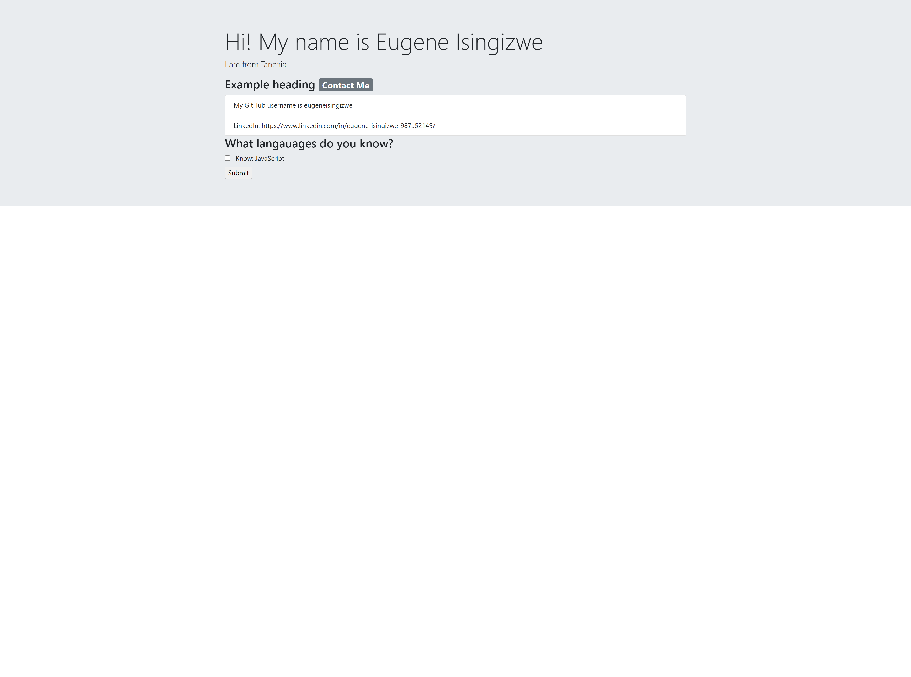

# Portfolio- Generator-

## Description

In this project, I am builing a command-line tool that generates an HTML portfolio page from user input.

## Instructions

* The application should prompt the user for information like their name, location, bio, LinkedIn URL, GitHub URL, etc

* An HTML document containing the information collected from the prompts should be constructed and written to the file system. 

## Installation

* The application usus the following tools and technologies to accomplish this:

  * `fs` for writing to the file system

  * `inquirer` version 8.2.4 for collecting user input

  * String template literals for generating a string version of the HTML document before it is written to the file system

## Usage
* Link to recorded video: https://drive.google.com/file/d/1y8AJbYK5VmKYFpwND1u0PpiFXmAOFqP-/view 

---

© 2022 Trilogy Education Services, LLC, a 2U, Inc. brand. Confidential and Proprietary. All Rights Reserved.
